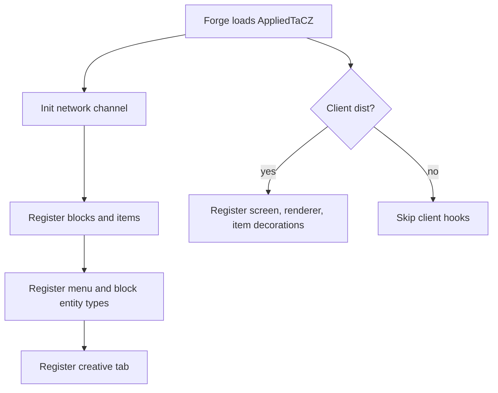
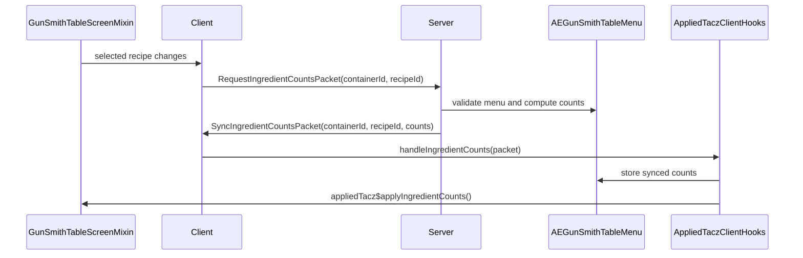

# AppliedTaCZ Code Flow

This document explains the mod's flow end to end, from startup to client rendering.
It focuses on the code in this repository and calls out where the mod leans on upstream TaCZ or AE2 behavior.

## 1. Startup And Registration

The main entry point is [`AppliedTaCZ`](../src/main/java/me/myogoo/appliedtacz/AppliedTaCZ.java).

On mod construction it:

1. Gets the Forge mod event bus.
2. Initializes the network channel through `AppliedTaczNetwork.init()`.
3. Registers blocks, items, menu types, block entities, and the creative tab through deferred registers.
4. Installs client-only listeners only when the game is running on the client.

The important registration classes are:

- [`AETaCZBlock`](../src/main/java/me/myogoo/appliedtacz/init/AETaCZBlock.java)
- [`AETaczMenu`](../src/main/java/me/myogoo/appliedtacz/init/AETaczMenu.java)
- [`AETaCZBlockEntity`](../src/main/java/me/myogoo/appliedtacz/init/AETaCZBlockEntity.java)
- [`AETaCZCreativeTab`](../src/main/java/me/myogoo/appliedtacz/init/AETaCZCreativeTab.java)
- [`AppliedTaczClient`](../src/main/java/me/myogoo/appliedtacz/client/AppliedTaczClient.java)

`AETaCZBlock` registers the three workbench blocks and their matching item forms.
Each item is a custom [`AETaCZTableItem`](../src/main/java/me/myogoo/appliedtacz/item/AETaCZTableItem.java) so the item stack can carry the upstream workbench id that determines which TaCZ table variant should be shown.

## 2. Block Placement And Block Entity Lifecycle

The runtime block logic lives in [`GunSmithTable`](../src/main/java/me/myogoo/appliedtacz/block/GunSmithTable.java), which extends TaCZ's base table block.

When a player places one of these blocks:

1. The block item decides which upstream workbench id should be attached.
2. `GunSmithTable.setPlacedBy(...)` resolves the root table position.
3. The code looks up the block entity at the root and the connected partner block.
4. Both block entities receive the same table id, and the placer becomes the owner when available.

The block entity implementation is [`AEGunSmithTableBlockEntity`](../src/main/java/me/myogoo/appliedtacz/block/blcokentity/AEGunSmithTableBlockEntity.java).
It is an AE2 grid-connected block entity that also acts as a `MenuProvider`.

Key lifecycle points:

- `loadTag(...)` restores the stored workbench id from NBT.
- `saveAdditional(...)` persists the current id and AE grid node state.
- `onReady()` creates the AE grid node in-world.
- `onChunkUnloaded()` and `setRemoved()` destroy the node.
- `onMainNodeStateChanged(...)` mirrors power / online / booted state into client-side fields so the UI can render status without querying the grid every frame.

The block entity is not just decorative. It is the bridge between TaCZ's workbench UI and the AE2 storage network.

## 3. Opening The Menu

Right-clicking the block uses the `use(...)` override in [`GunSmithTable`](../src/main/java/me/myogoo/appliedtacz/block/GunSmithTable.java).

The server-side path is:

1. Resolve the root position of the multi-block structure.
2. Fetch the root block entity.
3. Open a screen through `NetworkHooks.openScreen(...)`.
4. Write the root position and the workbench id into the extra data buffer.

The menu type is registered in [`AETaczMenu`](../src/main/java/me/myogoo/appliedtacz/init/AETaczMenu.java).
That menu type is created with [`AEGunSmithTableMenu.TYPE`](../src/main/java/me/myogoo/appliedtacz/menu/AEGunSmithTableMenu.java), which reads the buffer back out:

1. Read `BlockPos`.
2. Read `ResourceLocation` workbench id.
3. Resolve the live block entity from the world.
4. Construct the menu around that block entity.

[`AEGunSmithTableMenu`](../src/main/java/me/myogoo/appliedtacz/menu/AEGunSmithTableMenu.java) extends TaCZ's `GunSmithTableMenu`, so it preserves the upstream recipe and crafting behavior while adding AE-aware ingredient counting and inventory extraction.

## 4. Ingredient Count Sync

The ingredient count sync path is split across client, server, and menu state.

### Client side

`GunSmithTableScreenMixin` intercepts the TaCZ screen behavior:

- `updateIngredientCount` is invalidated when the selected recipe changes.
- `getPlayerIngredientCount` is redirected for AE menus.
- `addCraftButton` is replaced so the craft button can request synced counts before crafting.
- `renderIngredient` formatting is changed so AE menus can show AE-style counts.
- The bottom-of-screen network status line is drawn during `render(...)`.

### Request packet

[`RequestIngredientCountsPacket`](../src/main/java/me/myogoo/appliedtacz/network/packet/RequestIngredientCountsPacket.java) is sent from client to server with:

- the container id
- the selected recipe id

The server validates that:

1. A sender exists.
2. The sender is still using the expected container.
3. The container is an `AEGunSmithTableMenu`.

If those checks pass, the menu computes ingredient counts and replies with a sync packet.

### Server side count computation

`AEGunSmithTableMenu.getAvailableIngredientCounts(...)` is the key server-side helper.
For each recipe ingredient it:

1. Counts matching items in the player inventory.
2. Counts matching items in the AE2 storage network, if a storage service is present.
3. Uses fuzzy matching against AE item keys so alternate but valid item stacks are counted correctly.

### Sync packet and client hook

[`SyncIngredientCountsPacket`](../src/main/java/me/myogoo/appliedtacz/network/packet/SyncIngredientCountsPacket.java) returns the counts to the client.
`AppliedTaczClientHooks.handleIngredientCounts(...)` then:

1. Verifies the current client menu still matches the packet.
2. Stores the counts inside `AEGunSmithTableMenu`.
3. Notifies the active screen if it implements `IngredientCountSyncTarget`.

That callback is implemented by the screen mixin, which re-renders the synced counts immediately.

## 5. Crafting Flow

The craft button logic in `GunSmithTableScreenMixin` is client-side only.

Behavior:

1. If the current recipe is missing, do nothing.
2. If the player is not creative and counts are already synced, check that every ingredient has enough total items.
3. If counts are not yet synced, request them first.
4. Send the upstream TaCZ `ClientMessageCraft` to continue the normal crafting path.

This mod does not replace TaCZ crafting outright.
It augments the UI so AE network inventory counts are considered and displayed before the craft request is sent.

When the upstream TaCZ craft path reaches [`AEGunSmithTableMenu.doCraft(...)`](../src/main/java/me/myogoo/appliedtacz/menu/AEGunSmithTableMenu.java), this menu becomes the authoritative inventory consumer:

- It resolves the recipe by id.
- It reserves items from the player inventory first.
- It then reserves items from the AE2 storage service when needed.
- If all inputs are available, it removes the items and gives the crafted result to the player.

If the result cannot fit in the inventory, it is dropped like a normal item stack.

## 6. Client Rendering And Status UX

Client setup happens in [`AppliedTaczClient`](../src/main/java/me/myogoo/appliedtacz/client/AppliedTaczClient.java):

- register the screen for `AE_GUN_SMITH_TABLE`
- register the block entity renderer
- register item decorations

The screen mixin renders AE network status at the bottom of the GUI.
It shows one of four states derived from the block entity:

- offline
- no channel / not online
- booting
- connected

The block entity renderer in [`AEGunSmithTableRenderer`](../src/main/java/me/myogoo/appliedtacz/client/renderer/AEGunSmithTableRenderer.java) resolves the correct TaCZ block index and renders the table model only for the root block of the multi-block structure.

`AETaCZItemDecorators` adds the small storage-bus style badge to the block items in inventories so the AE support is visible outside the GUI.

## 7. Practical Mental Model

The shortest way to think about the mod is:

1. The block/item layer selects which TaCZ workbench variant a placed table represents.
2. The block entity hosts an AE2 grid node and stores the selected variant.
3. The menu bridges TaCZ crafting UI with AE2 storage counts.
4. The screen mixin patches the TaCZ UI so counts and status reflect AE data.
5. The server keeps crafting authoritative and still performs the final item extraction.

If you need to debug the flow, start in this order:

1. `AppliedTaCZ`
2. `GunSmithTable`
3. `AEGunSmithTableBlockEntity`
4. `AEGunSmithTableMenu`
5. `GunSmithTableScreenMixin`
6. `AppliedTaczClientHooks`
